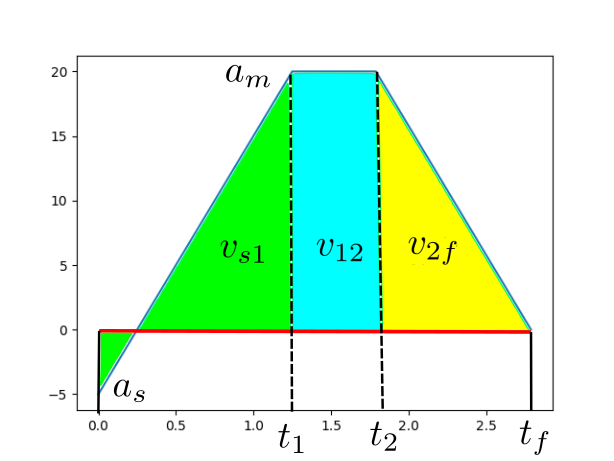
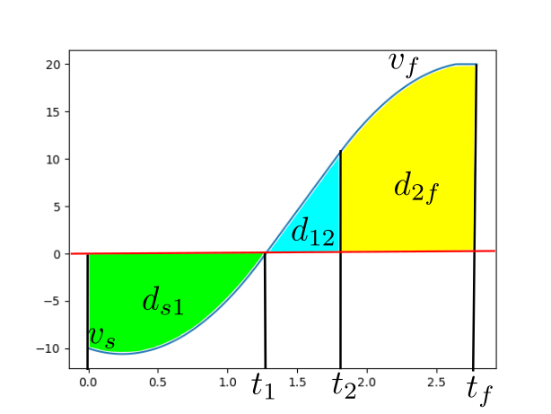

# velocity_profile
まだ目的地が正方向にある場合のみにしか対応していません
# 台形プロファイル
初期加速度，速度をそれぞれ $a_s, v_s$とする．最大加速度 $a_m$ まで一定躍度 $j$ で変化する．その後一定加速度 $a_m$ で加速した後，一定躍度 $j$ で加速度が0になるように加速度を変化させ，最大速度 $v_m$に達する．このとき $a_m$ に達するまでの時間を $t_1$, 加速度が $a_m$に達した後再び変化し始める時間を $t_2$, 最大速度に達する時間を $t_f$とする．
## 加速時

### 加速時の速度
$$
\begin{align}
    t_{a1} &= \frac{a_m - a_s}{j_{a1}} \\ 
    t_{af} - t_{a2} &= \frac{a_{am}}{j_{af}} \\
    v_{s1} &= \int_0^t (a_s + j_{a1}t)\ dt + v_s =a_st + \frac{1}{2}j_{a1}t^2 + v_s \\
    v_{12} &= \int_{t_{a1}}^{t} (a_{am})dt + v_{s1} = a_{am}(t - t_{a1}) + v_{s1} \\
    v_{2f} &= \int_{t_{a2}}^{t} (a_{am} + j_{af}(t - t_{a2}))dt + v_{12} = a_{am}(t - t_{a2}) + \frac{j_{af}}{2}(t - t_{a2})^2 + v_{12} 
\end{align}
$$

### 加速時の速度の拘束条件
$$
\begin{aligned}
v_m &=  v_s + a_st_{a1} + \frac{j_{a1}}{2}t_{a1}^2 + a_{am}(t_{a2} - t_{a1}) + a_{am}(t_{af} - t_{a2}) + \frac{j_{af}}{2}(t_{af} - t_{a2})^2\\
\Rightarrow v_m &= v_s + a_st_{a1} + \frac{j_{a1}}{2}t_{a1}^2 + a_{am}(t_{af} - t_{a1}) + \frac{j_{af}}{2}(t_{af} - t_{a2})^2 \\
\Rightarrow t_{af} &= \frac{1}{a_{am}}\left(v_m - v_s - a_st_{a1} - \frac{j_{a1}}{2}(t_{af} - t_{a1})^2 - \frac{j_{af}}{2}(t_{af} - t_{a2})^2\right) + t_{a1} \\
&= \frac{1}{a_{am}}\left\{v_m - v_s - a_st_{a1} - \frac{(a_{am} - a_s)^2}{2j_{a1}} - \frac{a_{am}^2}{2j_{af}}\right\} + t_{a1} 
\end{aligned}
$$
したがって
$$
\begin{align}
    t_{a2} &= t_{af} - \left|\frac{a_{am}}{j_{af}}\right|
\end{align}
$$
また，
$$
\begin{align}
    t_{af} - t_{a1} &= \frac{1}{a_{am}}\left\{v_m - v_s - a_st_{a1} - \frac{(a_{am} - a_s)^2}{2j_{a1}} - \frac{a_{am}^2}{2j_{af}}\right\}
\end{align}
$$

### 加速時の走行距離
$$
\begin{align}
d_{s1} &= \int_0^t \left(a_st + \frac{j}{2}t^2 + v_s\right) dt = \frac{a_s}{2}t^2 + \frac{j_{a1}}{6}t^3 + v_st \\
d_{12} &= \int_{t_1}^t \left(a_m(t - t_1) + v_{s1}\right) dt = \frac{a_m}{2}(t - t_1)^2 + v_{s1}(t - t_1) \\
d_{2f} &= \int_{t_2}^{t} \left(a_m(t - t_2) + \frac{j}{2}(t - t_2)^2 + v_{12}\right)dt \\
 &= \frac{a_m}{2}(t - t_2)^2 + \frac{j_{af}}{6}(t - t_2)^3  + v_{12}(t - t_2) \\
d_a &= d_{s1} + d_{12} + d_{2f}\\
&= v_st_{af} + a_st_{a1}\left(t_{af} - \frac{t_{a1}}{2} \right) + \frac{a_{am}}{2}(t_{af} - t_{a1})^2 \\
&+ \frac{j_{a1}}{6}t_{a1}^2\left(3t_{af} - 2t_{a1}\right) + \frac{j_{af}}{6}\left(t_{af} - t_{a2}\right)^3
\end{align}
$$

## 減速時
### 減速時の速度
$$
\begin{align}
t_{d1} &= \frac{a_{dm}}{j_{d1}} \\
t_{df} - t_{d2} &= \frac{a_{dm}}{j_{df}} \\
j_{d1} &= -j_{df}\\
v_{s1} &= v_m + \int_0^t \left(j_{d1}t\right)dt = v_m + \frac{j_{d1}}{2}t^2 \\
v_{12} &= v_{s1} + \int_{t_{d1}}^t \left(a_{dm}\right)dt = v_{s1} + a_{dm}(t - t_{d1}) \\
v_{2f} &= v_{12} + \int_{t_{d2}}^t\left(a_{dm} + j_{df}(t - t_{d2})\right)dt = v_{12} + a_{dm}(t - t_{d2}) + \frac{j_{df}}{2}(t - t_{d2})^2  
\end{align}
$$
### 減速時の速度の拘束条件
$$
\begin{align}
0 &= v_m + a_{dm}(t_{df} - t_{d1}) + \frac{j_{df}}{2}\left(t_{df} - t_{d2}\right)^2 + \frac{j_{d1}}{2}t_{d1}^2 \\
\Rightarrow v_m &= a_{dm}(t_{df} - t_{d1}) \\
\Rightarrow t_{df} &= \frac{v_m}{a_{dm}} + t_{d1}
\end{align}
$$
### 減速時の走行距離
$$
\begin{align}
d_{s1} &= \int_0^t \left(v_m + \frac{j_{d1}}{2}t^2\right) dt = v_mt + \frac{j_{d1}}{6}t^3\\
d_{12} &= \int_{t_{d1}}^t \left(v_{s1} + a_{dm}(t - t_{d1})\right) dt = v_{s1}(t - t_{d1}) + \frac{a_{dm}}{2}(t - t_{d1})^2  \\
d_{2f} &= \int_{t_{d2}}^t \left(v_{12} + a_{dm}(t - t_{d2}) + \frac{j_{df}}{2}(t - t_{d2})^2\right) dt\\
&= v_{12}(t - t_{d2}) + \frac{a_{dm}}{2}(t - t_{d2})^2 + \frac{j_{df}}{6}(t - t_{d2})^3 \\
d_d &= d_{s1} + d_{12} + d_{2f} \\
&= v_mt_{df} - \frac{a_{dm}}{2}(t_{df} - t_{d1})^2 + \frac{j_{df}}{6}\left\{t_{d1}^2(2t_{d1} - 3t_{df}) + (t_{df} - t_{d2})^3\right\}
\end{align}
$$

<!-- ##　加減速時に走破する距離
$$
\begin{align}
    d_a + d_d &= v_st_{af} + a_st_{a1}\left(t_{af} - \frac{t_{a1}}{2}\right) + \frac{j}{6}\left(t_{a1}^2t_{af} - t_{d1}^2t_{df}\right) + v_mt_{df} \\
    & + \frac{1}{2a_{am}}\left(v_m - v_s + \frac{a_s^2}{2j}\right)^2 - \frac{1}{2a_{dm}}v_m^2 \\
    &= \left(\frac{a_s}{a_{am}^2} + \frac{1}{2a_{am}} + \frac{1}{2a_{dm}}\right)v_m^2 \\
    &+ \left\{\frac{a_s}{a_{am}^2}\left(\frac{a_s^2}{j} - 2v_s\right) + \frac{1}{a_{am}}\left(\frac{jt_{a1}}{6} - \frac{a_sa_{am}}{2j} \right) - \frac{jt_{d1}^2}{6a_{dm}} + t_{d1}\right\}v_m \\ 
    &+\left(\frac{a_s}{a_{am}^2} + \frac{1}{2a_{am}}\right)\left(\frac{a_s^2}{2j} - v_s\right)^2 + \left(\frac{6v_s + 3a_st_{a1} + jt_{a1}^2}{6a_{am}}\right)\left(\frac{a_s^2}{2j} - v_s\right) \\
    &+ \frac{v_s}{j}(a_{am} - a_s) - \frac{t_{d1}^2}{2}a_s + \frac{j}{6}(t_{a1}^3 - t_{d1}^3)
\end{align}
$$ -->

## 直ちに終端速度に向かう場合
直ちに終端速度に向かって加減速する場合に走破する距離を$d_i$とする
### 減速する場合
$$
\begin{align}
    t_1 &= \frac{a_m + a_s}{j} \\
    t_f - t_2 &= \frac{a_m}{j} \\
    v_{s1} &= v_s - \int_0^{t_1} \left(a_s - jt\right)dt \\
    &= v_s - a_st_1 + \frac{j}{2}t_1^2 \\
    v_{12} &= v_{s1} - \int_{t_1}^t a_m dt \\
    &= v_{s1} - a_m(t - t_1) \\
    v_{2f} &= v_{12} - \int_{t_2}^t \left(a_m - j(t - t_2)\right) \\
    &= v_{12} - a_m(t - t_2) + \frac{j}{2}(t - t_2)^2
\end{align}
$$

$$
\begin{align}
    d_{s1} &= \int_0^t \left(v_s - a_st + \frac{j}{2}t^2\right) \\
    &= v_st - \frac{a_s}{2}t^2  + \frac{j}{6}t^3 \\
    d_{12} &= \int_{t_1}^t \left(v_{s1} - a_m(t - t_1)\right)dt \\
    &= v_{s1}(t - t_1) - \frac{a_m}{2}(t - t_1)^2 \\
    d_{2f} &= \int_{t_2}^t \left(v_{12} - a_m(t - t_2) + \frac{j}{2}(t - t_2)^2\right) \\
    &= v_{12}(t - t_2) - \frac{a_m}{2}(t - t_2)^2 + \frac{j}{6}(t - t_2)^3
\end{align}
$$

## 加速度の最大値の再設計
### 加速時
$$
\begin{align}
    \Delta v_{s1} &= \int_0^{t_1} (a_s + jt)\ dt + v_s =a_st_1 + \frac{1}{2}jt_1^2\\
    &= \frac{a_s}{j}(a_m - a_s) + \frac{(a_m - a_s)^2}{2j} + v_s \\
    \Delta v_{2f} &= \int_0^{(t_f - t_2)} (a_m - jt) dt = a_m(t_f - t_2) - \frac{j}{2}(t_f - t_2)^2 \\
    &= \frac{a_m^2}{j} - \frac{a_m^2}{2j} = \frac{a_m^2}{2j} \\
    v_{s1} + v_{2f} &= \frac{a_m^2}{j} - \frac{a_s^2}{2j}
\end{align}
$$
$\Delta v_{s1} + \Delta v_{2f} > v_m - v_s$である場合には最大加速度を調整する．
$$
    a_m' = \sqrt{j\left(v_m - v_s + \frac{a_s^2}{2j}\right)}
$$

### 減速時
$$
\begin{align}
    \Delta v_{s1} &= - \int_0^{t_1} \left(jt\right)dt = - \frac{j}{2}t_1^2 \\
    &= - \frac{a_m^2}{2j}\\
    \Delta v_{2f} &= - \int_{0}^{(t_f - t_2)}\left(a_m - jt\right)dt = - a_m(t_f - t_2) + \frac{j}{2}(t_f - t_2)^2 \\
    &= -\frac{a_m^2}{j} + \frac{a_m^2}{2j} \\
    \Delta v_{s1} + \Delta v_{2f} &= -\frac{a_m^2}{j}
\end{align}
$$
$\Delta v_{s1} + \Delta v_{2f} < -v_m$である場合には加速度の調整が必要
$$
    a_m = \sqrt{jv_m}
$$
## 条件分岐
### 符号に関して
1. $d \ge 0$であれば$v_m > 0$
2. $d \ge 0 \cap v_s < v_m$ならば$a_m > 0$
2. $d \ge 0 \cap v_s \ge v_m$ならば$a_m \le 0$
### 設計に関して
1. $d_a + d_d \le d$であれば$v_m, a_m$そのまま
2. $d_a + d_d > d$であれば$v_m$を再設計する必要あり
3. $d_i >= d$すぐに終端速度に向けて減速する必要あり